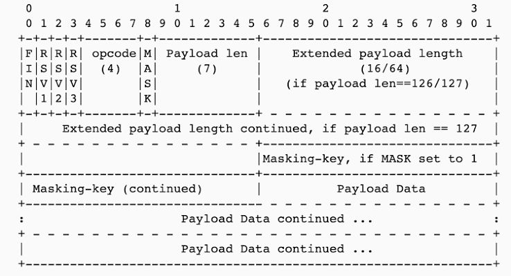

FIN (1 bit) -> whether the message is final or not (fragmented packets)
RSV bits (3 bit net) -> rarely used and is of 3 bits overall to used to reserve stuffs used rarely

---

opcode(4) ->
bit 1 : data or control frame (see this engineering damn thats where the efficiency comes in)

control frame  
 1000->close frame
1001-> ping frame
1010-> pong frame

data frames
0000 -> cont frame (fragmention stuffs more things comming)
0001 -> text frame
0010 -> binary frame

---

MASK
it tells whether the payload data is masked or not
we do this encoding to encrypt things so the messages are secured
prevent server side xss attacks and all

---

Payload len (7 bit)

0-2^7(0 to 127)
length of the core data payload

see real engineering we dont have to parse the entire message Just read the header get the payload length and boom you know exactly how much core data to read.

---

extended payload length ()
Payload length (0–125) -> actual payload length is directly in the 7-bit field

Payload length (126) -> next 2 bytes contain the actual payload length & max 65,535 bytes

Payload length (127)-> next 8 bytes contain the actual payload length & very large payloads

---

masking key(4 bytes)
if above mask is set to 1
see the beauty no reserved size only if set to 1 then these 4 bytes are occupied else not

---

payload data & payload data continue
real payloads data things comes in here
if payload are huge those they go inside the continue stuffs
and even if more than that then fragmentation things

---

conclusion : see these stuffs these are the stuffs that comes with every messages every messages see how smartly engineers has develop this those pregenerated meta data stuffs and all router and all dont have that huge computation power and all shit so these are beauty fragmentation stuffs and all happens in good time and all ! love this header design
